# SmartCart - E-Commerce Web Application


---

## About the Project

SmartCart is a large-scale, fully-featured e-commerce web application built with security, scalability, and performance in mind.  
It uses **ASP.NET Core Identity** for comprehensive authentication and authorization, ensuring robust security for users and administrators.

The project implements clean architecture and best practices using:

- Design Patterns
- Unit of Work & Repository Pattern
- Dependency Injection

The front-end is designed with a focus on excellent **UI/UX**, using **Bootstrap** and modern web technologies for responsiveness and smooth user experience.

Additional advanced features include:

- Integration with **Google Maps** for location-based services
- Multiple payment methods to accommodate diverse users
- Continuous support and feedback-driven updates
- Regular updates for best-selling products and categories

---

## Key Features

### 1. Comprehensive Dashboard
- Real-time overview of products, categories, orders, and users
- Visual indicators and counters for products, categories, orders, and statuses
- Full management of product lifecycle, categories, and user permissions


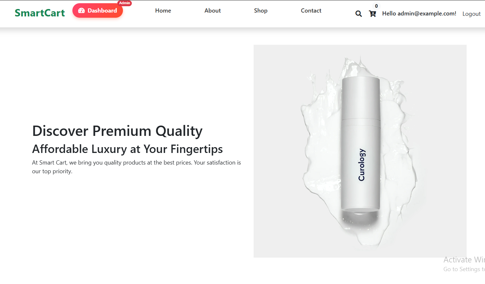

### 2. Product and Category Management
- Full CRUD operations for products and categories
- Efficient category assignment and management tools

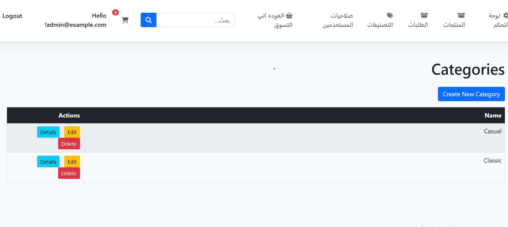
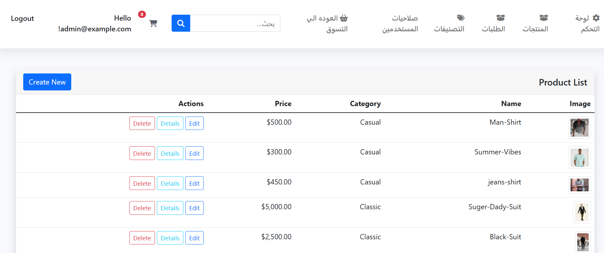

### 3. User Management and Roles
- Full user and roles administration
- Permissions system to control access across the platform

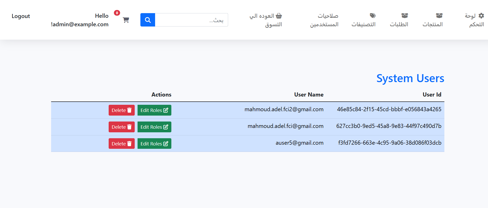

### 4. Order Management
- Track orders, payment status, and delivery status in real-time
- Comprehensive order processing system with detailed status updates

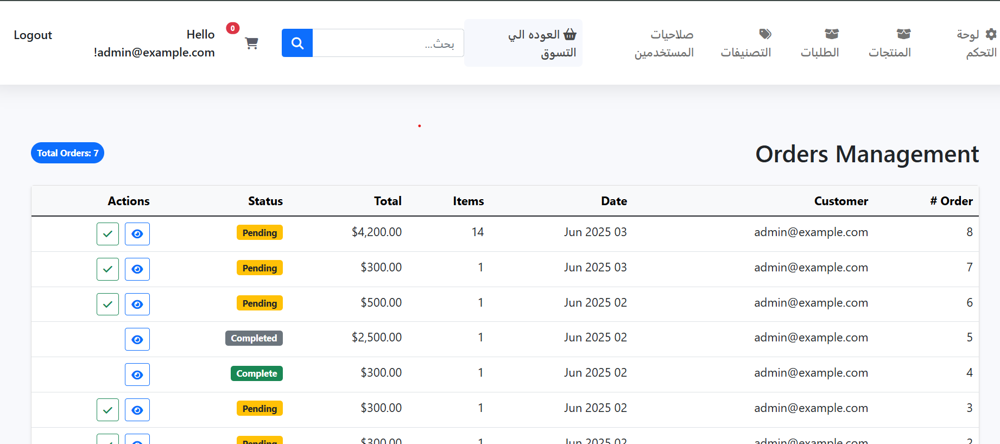
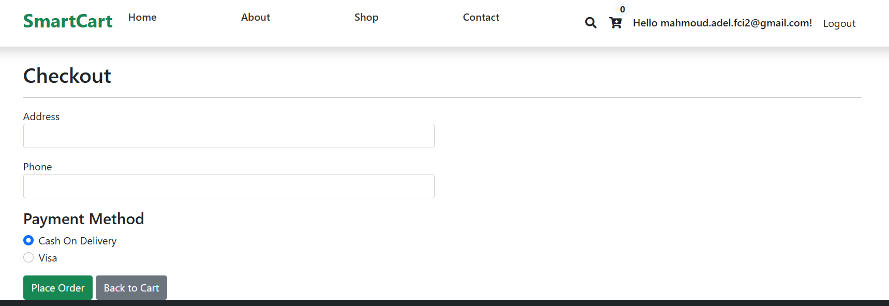

### 5. Shopping and Cart Experience
- Smooth, intuitive user shopping experience with responsive UI
- Product info and cart management pages optimized for usability

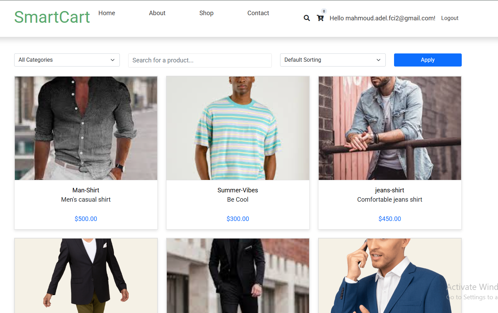
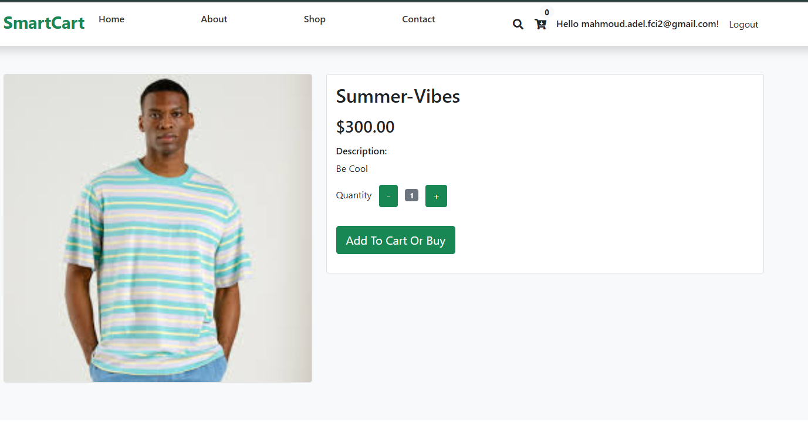
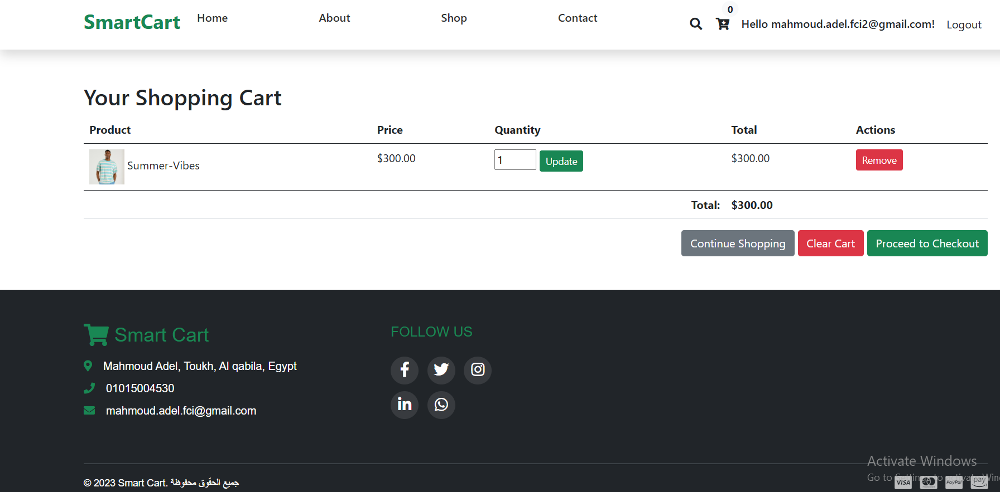

### 6. Authentication and Feedback
- Secure login system with full Identity integration
- User feedback system for continuous improvement

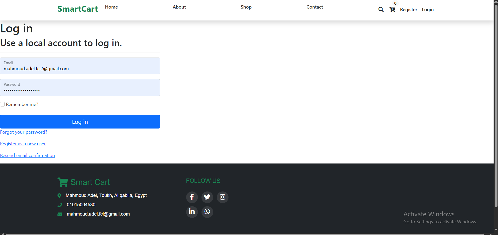
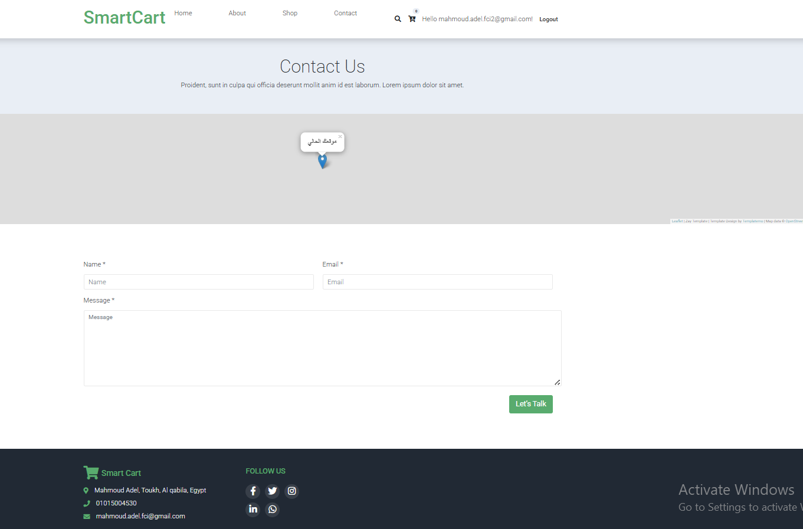

### 7. Real User Interaction and Analytics
- Real user activity monitoring and analytics for better decisions

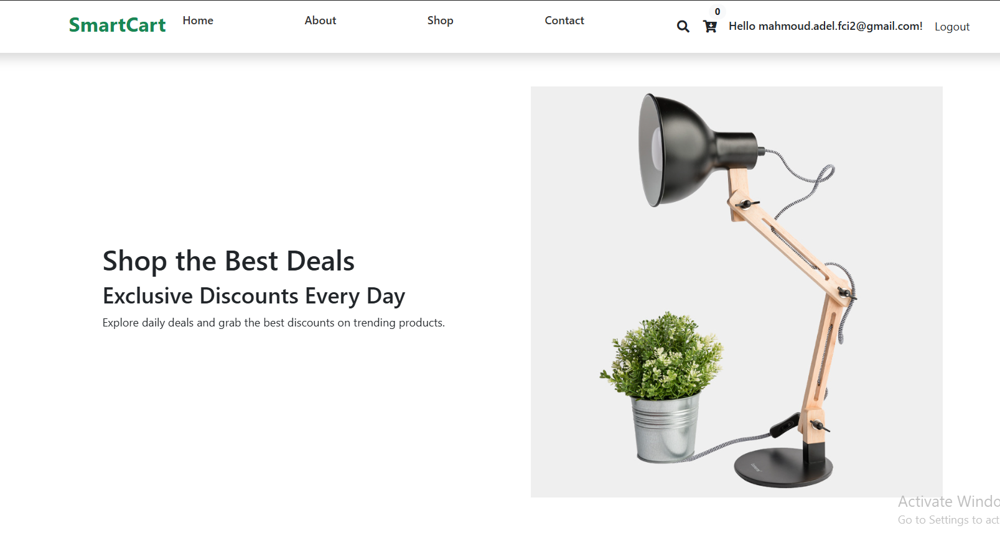

---

## Technologies Used

- ASP.NET Core 6
- Entity Framework Core
- ASP.NET Core Identity
- Bootstrap 5
- Google Maps API
- JavaScript / jQuery
- SQL Server

---

## Getting Started

1. Clone the repository:

```bash
git clone https://github.com/EngMahmoudAdel/SmartCart.git
